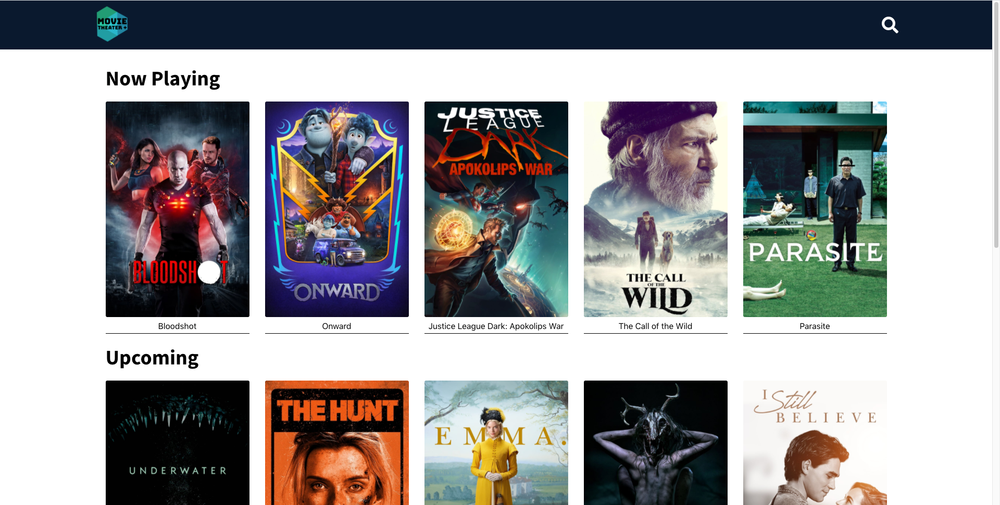
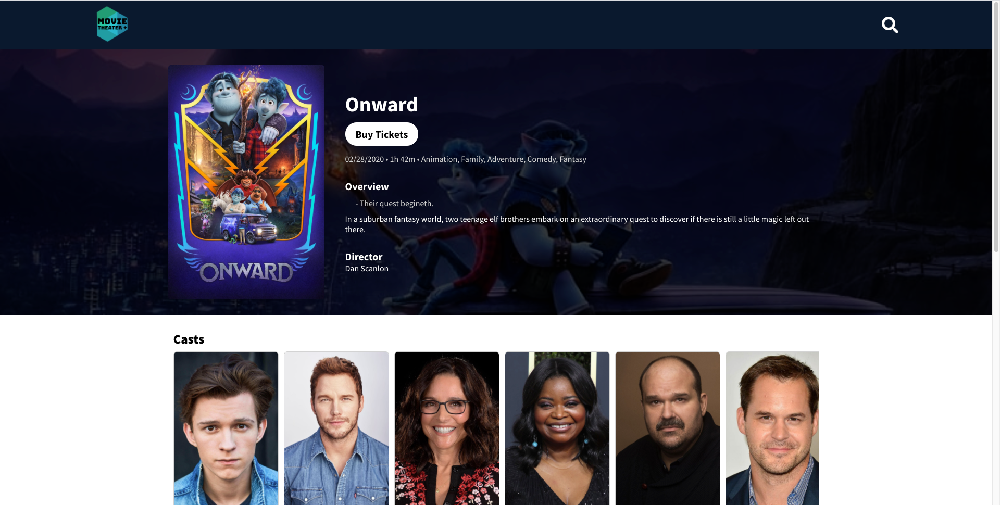
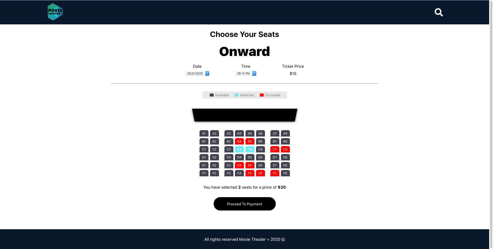

# Movie Theater +

This is frontend app created by React, which allows people to search for movie info and select seat for a selected movie.

[Live Demo](https://affectionate-agnesi-f7c5bd.netlify.app/)

## API Used

The Movie Database (TMDb) API - [Link](https://www.themoviedb.org/documentation/api)
 
The New York Times API - [Link](https://developer.nytimes.com/)
